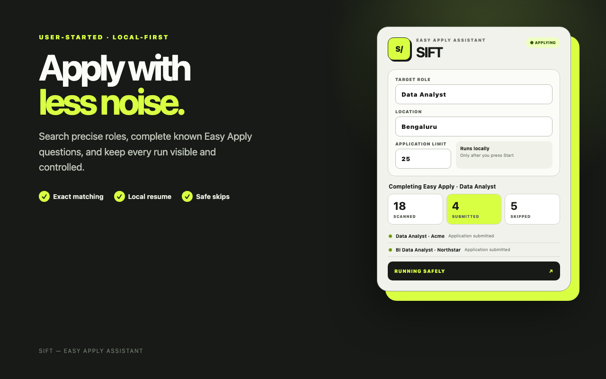

# SIFT

SIFT is a local-first LinkedIn Easy Apply assistant with precise role/location matching, reusable application answers, visible progress, and safe skips.



## What is included

- A polished Manifest V3 Chrome extension in `extension/`.
- Fixed 25-result pagination, persistent job-ID deduplication, and standalone-job recovery.
- Exact or contains-title matching, excluded title terms, city/country/worldwide/remote location support.
- PDF resume upload and a reusable custom answer bank.
- Submission confirmation before an application is counted.
- Configurable application and scan limits, watchdog recovery, and an immediate Stop control.
- Chrome Web Store listing copy, disclosures, reviewer instructions, icon, screenshot, and promo tile in `store-listing/`.
- A public [privacy policy](PRIVACY.md) and upload-ready ZIP package in `dist/`.

## Test the extension

1. Open `chrome://extensions` in Chrome.
2. Enable **Developer mode** and choose **Load unpacked**.
3. Select the `extension` directory.
4. Open SIFT's setup page and save a PDF resume plus truthful application answers.
5. Stay signed in to LinkedIn and start a small run from the extension popup.

SIFT runs only after the user presses Start, uses a visible LinkedIn tab, skips unknown required questions, and stops on security checks. It does not ask for LinkedIn credentials or bypass CAPTCHAs.

## Build the Chrome Web Store ZIP

```sh
./scripts/package-extension.sh
```

The script validates the manifest and JavaScript, includes only extension runtime files, and verifies the resulting archive. Use [store-listing/SUBMISSION-CHECKLIST.md](store-listing/SUBMISSION-CHECKLIST.md) for the dashboard steps.

## Local web workspace

The separate job-search workspace can be previewed with:

```sh
python3 -m http.server 8080
```

Then open `http://localhost:8080`. For minimum Chrome permissions, the production extension is controlled from its toolbar popup rather than by injecting a bridge into the website.

## Important limitations

LinkedIn can change its UI or restrict automated activity. SIFT cannot guarantee that every Easy Apply form will work, and users are responsible for truthful answers and compliance with LinkedIn's terms and applicable rules.
